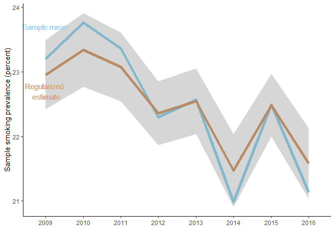

Surveys on smoking habits can be analyzed more effectively
----------------------------------------------------------

The smoking habits of Danish youth is frequently discussed these days, with retailers and politicians competing to announce new measures and proposals for curbing youth smoking.

Reliably measuring youth smoking frequencies is harder than you might expect though - see <http://altandetlige.dk/blog/6644/kommet-unge-dagligrygere-712> (only available in Danish).

The official data on the smoking habits of the Danish population is collected by every year by Danish Department of Health. A nationally representative sample of 5,000 people are surveyed, and the National smoking frequency is measured by the sample smoking frequency. That's it. No mension of uncertainty, no analysis.

But the data can be used much more efficiently. Just consider the 2016 survey. The Danish Cancer Society collect data on smoking rates. Their survey samples youth (aged 16-25) specifically, and 2,000 youth are surveyed. Youth are not equivalently grouped in the official data (but in the ages 15-19 and 20-29). However, similar inferences could have been obtained from the official data, had you more efficiently exploited the information in the data.

This is where multilevel modelling comes in.

What the smoking rates look like
--------------------------------

Unfortunately the data behind the official smoking rates is unfortunately not publicly available. The data are available annually after 1997, with a missing year in 2008. The smoking rates have experienced a consistent downward trend over the past 20 years.


Data contain lots of variables, the majority of which are not fully consistent over the years. Here I'll focus on the most central stratefication variables as well as the main question "Do you smoke?". These variables have been consistently collected since 2008, before which the survey setup was somewhat different.

Since 2009 the smoking rate for young people (aged 16-29) has followed the overall smoking rate, but with larger deviations due to the smaller sample size (roughly 20 percent of the sample is below 30 years of age.).


I've added some error bars showing two standard deviations to get a feel for the sample size. Looking at the two plots already gives cause for concern about the reliability of the stratification of the survey sample. The pattern of the overall smoking rate in 2014-2016 looks like it's driven by noise. Comparing young people to the rest of the population, the changes from year to year are implausibly large, and young people seem to have smoking rates inversely correlated with the rest of the sample. Not much can be learned by looking at the changes from one year to the next.

Enter Bayesian data analysis
----------------------------

So what can we do to improve out understanding of the survey data? Bayesian modelling will allow us to incorporate prior knowledge into the data analysis. Why is this is useful? We've already realized that the swings in the smoking rate from year to year are implausible because we have an idea about how smoking rates change over time. The Bayesian approach allow us to incorporate this knowledge through a prior distribution.

To get a sense of how this works, I've estimated a simple model where the smoking rates depend only on the year, but allow for there to be a relationship between rates in different years. Below is what the data looks like.

``` r
str(model_data)
```

    ## 'data.frame':    40258 obs. of  4 variables:
    ##  $ smoker   : logi  FALSE FALSE FALSE FALSE TRUE FALSE ...
    ##  $ female   : 'labelled' num  0 0 0 1 1 0 1 1 1 1 ...
    ##   ..- attr(*, "labels")= Named num  1 2
    ##   .. ..- attr(*, "names")= chr  "mand" "kvinde"
    ##  $ age_group: Factor w/ 7 levels "1","2","3","4",..: 4 6 5 5 5 6 2 6 3 2 ...
    ##  $ year     : Factor w/ 8 levels "2009","2010",..: 1 1 1 1 1 1 1 1 1 1 ...

``` r
m1 <- stan_glmer(formula = smoker ~ 1 + (1 | year),
                family = binomial(link = "logit"),
                data = model_data)
```

Below is the posterior of the model (the regularized estimate), compared to the raw sample mean smoking rate. Even with this simple model, it's easy to how the prior information and the estimated structure of year-to-year changes is limiting the swings from year to year, and pulling the smoking rate towards the mean. Small changes, like 2012-2013, are barely affected, while implausibly large changes are regularized quite a bit. I've used the default priors in rstanarm, which are quite flat. Steeper (more conservative) priors would regularize the estimates even further.



Stay tuned - more to come...
----------------------------
